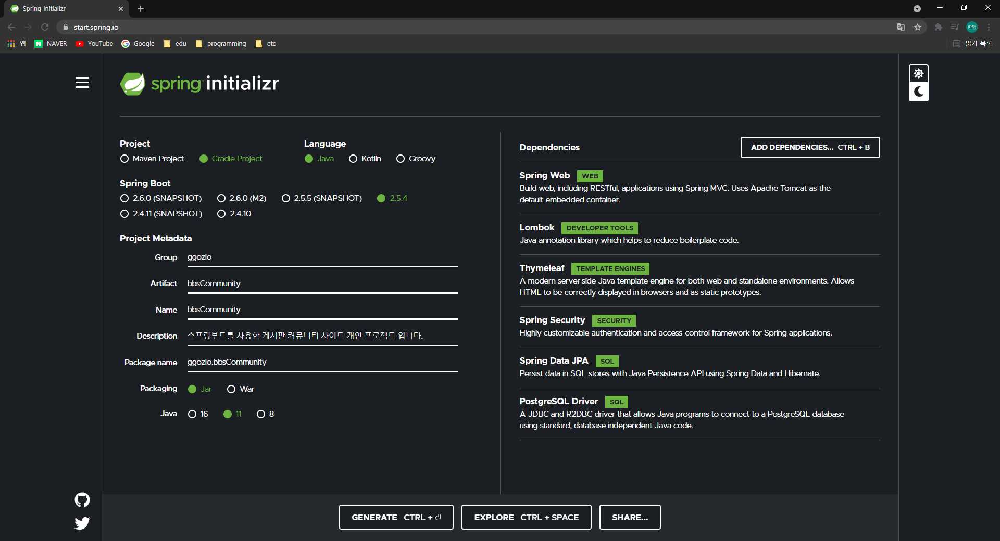

BBSCommunity
=============

---

### 개요
스프링 부트를 활용한 Controller - Service - Repository 구조의 MVC 웹 커뮤니티 프로젝트 입니다.    
DC인사이드, 아카라이브 에서 모티브를 얻어 사이트의 사용자들이 게시판을 생성하고 관리 권환을 획득하여
자체적으로 관리하는 커뮤니티 사이트를 제작하여 AWS 로 배포 하는것이 프로젝트의 목표 입니다.

___

###사용프레임워크 및 라이브러리
* Spring Boot
* Thymeleaf
* Spring Security
* Spring Validation
* Spring Data JPA
* PostgreSQL
##
###목표
  - ####게시글 (Post) 기능
    - [ ] 게시글 작성
    - [ ] 게시글 수정
    - [ ] 게시글 삭제
    - [ ] 게시글 추천 
    - [ ] 조회수 
  - ####댓글 (Comment) 기능
    - [ ] 비동기 댓글 작성 
    - [ ] 비동기 댓글 삭제 
  - ####게시판 (Board) 기능
    - [ ] 게시글 페이징 
    - [ ] 게시글 검색 
    - [ ] 추천 다수 획득 게시글 조회
  - ####회원 (Member) 기능
    - [ ] 회원가입 
    - [ ] 로그인 
    - [ ] 게시판 생성 요청
    - [ ] 작성한 게시글 조회
    - [ ] 작성한 댓글 조회
    - [ ] 게시판 활성화시 권한 획득
  - ####관리자 (Admin, Manager) 기능
    - [ ] 게시판 생성 요청 승인
    - [ ] 권한이 있는 게시판의 게시글 삭제
    - [ ] 게시판 폐쇄
    - [ ] 권한이 있는 게시판 수정
  - ####기타 기능 
    - [ ] 게시판 목록 페이지 조회
    - [ ] 게시판 검색
    - [ ] 최근 접속한 게시판 
##
    

  
  

---
##Version-0 _Initial Version_
###21.09.22
###
### 생성 화면

###
### Comment
개인 프로젝트 BBSCommunity 의 Initial 버전으로 프로젝트를 생성후
누락된 Spring Validation 을 추가하고 ReadMe에 목표와 개요를 작성하였습니다.
현재 수립된 목표를 기반으로 RDB를 설계하고 JPA Entity로 구현하여 버전 0.1.0 으로 등록할것입니다.  
추후 제작과정에서 세부 작업내용은 개인 티스토리에 업로드 하는것이 목표입니다.