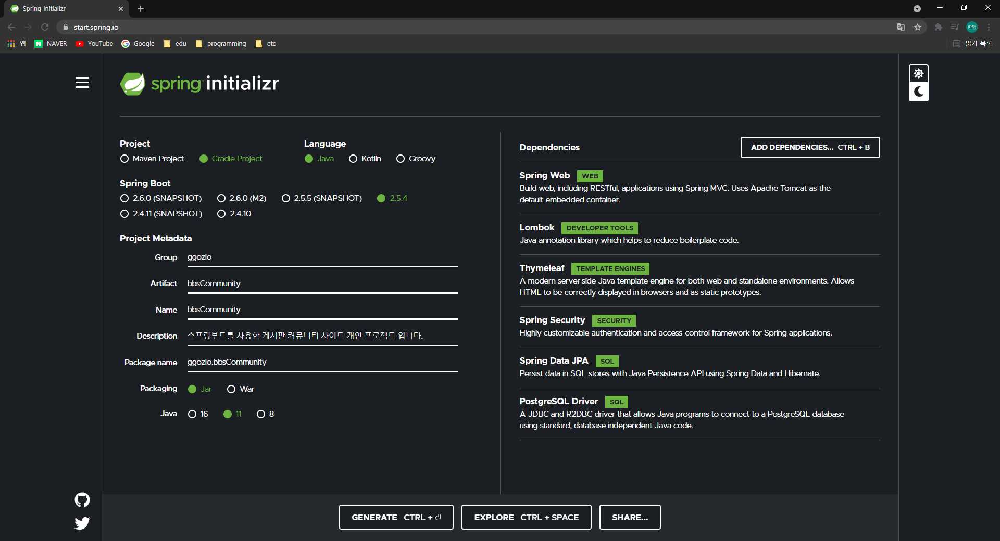
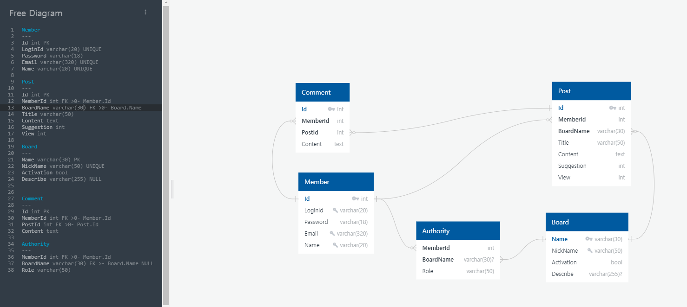

BBSCommunity
=============

---

### 개요
스프링 부트를 활용한 Controller - Service - Repository 구조의 MVC 웹 커뮤니티 프로젝트 입니다.    
DC인사이드, 아카라이브 에서 모티브를 얻어 사이트의 사용자들이 게시판을 생성하고 관리 권환을 획득하여
자체적으로 관리하는 커뮤니티 사이트를 제작하여 AWS 로 배포 하는것이 프로젝트의 목표 입니다.

___

### 사용기술
* JDK 15
* Spring Boot
* Thymeleaf
* Spring Security
* Spring Validation
* Spring Data JPA
* PostgreSQL
* Git
### 개발환경
* windows 10
* InteliJ Ultimate edition
##
### 목표
  - #### 게시글 (Post) 기능
    - [ ] 게시글 작성
    - [ ] 게시글 수정
    - [ ] 게시글 삭제
    - [ ] 게시글 추천 
    - [ ] 조회수 
  - #### 댓글 (Comment) 기능
    - [ ] 비동기 댓글 작성 
    - [ ] 비동기 댓글 삭제 
  - #### 게시판 (Board) 기능
    - [ ] 게시글 페이징 
    - [ ] 게시글 검색 
    - [ ] 추천 다수 획득 게시글 조회
  - #### 회원 (Member) 기능
    - [ ] 회원가입 
    - [ ] 로그인 
    - [ ] 게시판 생성 요청
    - [ ] 작성한 게시글 조회
    - [ ] 작성한 댓글 조회
    - [ ] 게시판 활성화시 권한 획득
  - #### 관리자 (Admin, Manager) 기능
    - [ ] 게시판 생성 요청 승인
    - [ ] 권한이 있는 게시판의 게시글 삭제
    - [ ] 게시판 폐쇄
    - [ ] 권한이 있는 게시판 수정
  - #### 기타 기능 
    - [ ] 게시판 목록 페이지 조회
    - [ ] 게시판 검색
    - [ ] 최근 접속한 게시판 
##

---
## Version-0 _Initial Version_
### 21.09.22
###
### 생성 화면

###
### Comment
개인 프로젝트 BBSCommunity 의 Initial 버전으로 프로젝트를 생성후
누락된 Spring Validation 을 추가하고 ReadMe에 목표와 개요를 작성하였습니다.
현재 수립된 목표를 기반으로 RDB를 설계하고 JPA Entity로 구현하여 버전 0.1.0 으로 등록할것입니다.  
추후 제작과정에서 세부 작업내용은 개인 티스토리에 업로드 하는것이 목표입니다.

--- 
## Version 0.1 basicDataBase
### 21.09.29
###
### ERD

###
### Comment
 1. PostgresSql 을 설치하고 해당 프로젝트와 연동하였습니다.  
이번 기회에 처음 사용해보는 DBMS 이지만 기존에 학습용으로 사용하던 오라클보다 AWS 에서 사용하기
좋다는 이야기를 봐서 사용해보기로 하였고 해당 프로젝트와 성공적으로 연동 하였습니다.
 2. 우선 제시된 목표에 맞춰서 DB를 설계하는게 가장 최우선으로 여기기때문에
QuickDBD 사이트에서 ERD 를 그렸습니다. DDL sql 파일도 획득하였지만 ORM 에서도 자동으로
생성해주는 기술이 있으므로 적용하지는 않았습니다.
 3. JPA Entity 를 작성하고 Junit5 테스트 프레임워크환경에서 순수 하이버네이트 기술을 사용하여 간단한 테스트를 진행하였습니다.   
테스트 단위를 좀더 쪼갯으면 좋았겟지만... 간단하게 작성하였습니다.  
[작성된 도메인들](/src/main/java/ggozlo/bbsCommunity/domain/entity)
[DB 테스트 파일](/src/test/java/ggozlo/bbsCommunity/db/MemberTest.java)
 4. 회원, 게시글, 댓글, 사용자 권한은 고유한 Id 넘버를 가지며 
게시판은 게시판 영문명을 PK 로 삼고 사이트 url 주소도 영문명으로 사용할 예정 입니다. 
 5. Authority 테이블은 한 사용자가 다수의 게시판의 관리자가 될수 있고 한 게시판은 다수의 
관리자를 보유할수 있기때문에 다대다 관계가 되어야 하지만 정규화를 통해 분리하였습니다.
Admin 권한은 해당테이블에서 정의할 예정이므로 BoardId 는 NULLABLE 로 적용하였습니다.
 6. 작성하다가 깨닫은 것이 생성시간과 수정시간을 누락했습니다.... 다음버전에서 상속기능을 사용하여
각 Entity 클래스들에 추가할 예정입니다.

